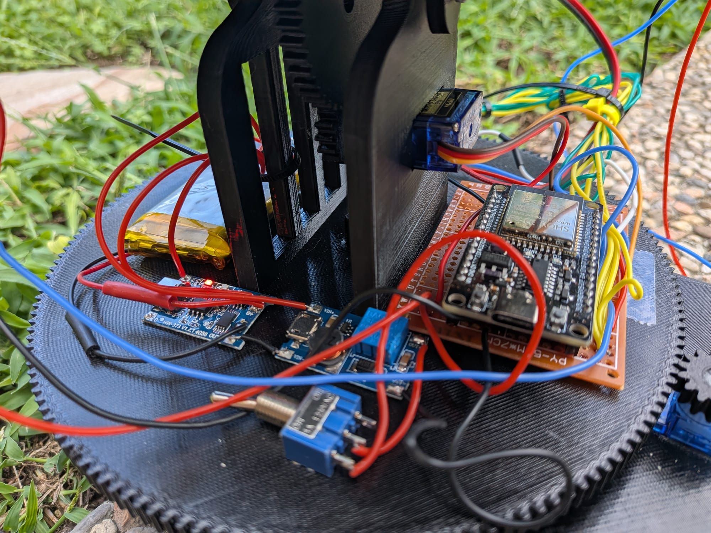
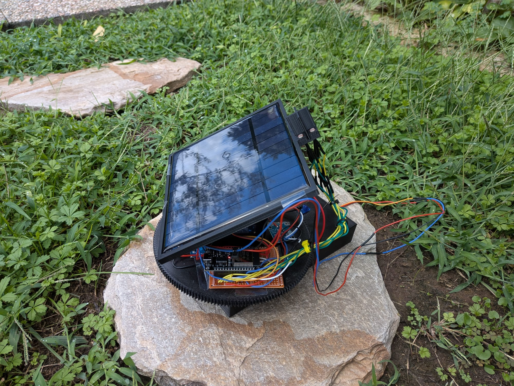
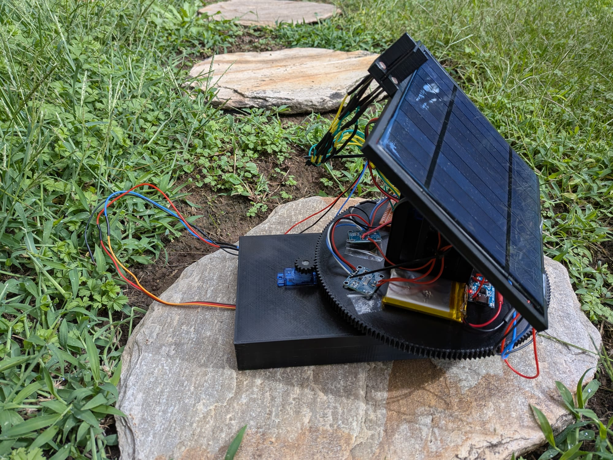

Progetto sviluppato nell'ambito della tesi di laurea triennale
Dipartimento di Ingegneria dell'Informazione, Università degli Studi di Padova. 
Relatore: Prof. Damiano Varagnolo.

## Indice

- [Introduzione](#introduzione)
- [Obiettivi](#obiettivi)
- [Progettazione 3D](#progettazione-3d)
- [Hardware](#hardware)
- [Firmware](#firmware)
- [Interfaccia web](#interfaccia-web)
- [Prototipo](#prototipo)
- [Stampa Definitiva](#stampa-definitiva)
- [Metodologia sperimentale](#metodologia-sperimentale)
- [Design of Experiments](#design-of-experiments)
- [Confronto](#confronto)
- [Documentazione](#documentazione)
## Introduzione
Le fonti rinnovabili di energia sono viste come un'alternativa affidabile ai combustibili fossili grazie alla loro capacità di essere inesauribili.
L'energia solare fotovoltaica è una delle fonti rinnovabili più a portata di mano rispetto all'energia geotermica, idrica, bioenergia oppure eolica.
Massimizzare il tempo passato perpendicolarmente al sole è uno dei metodi migliori per massimizzare l'efficienza di un pannello fotovoltaico
(dimostrabile secondo la formula $$P = G \cdot A \cdot \eta \cdot \cos(\theta)$$)

Per fare ciò, sistemi di tracciamento permettono ai pannelli solari di rimanere perpendicolari ai raggi solari per la maggior parte della giornata.
Lo scopo di questo progetto è quello di sviluppare un prototipo bi-assiale a scala ridotta di un sistema di tracciamento solare mediante l'uso di fotoresistenze per tracciare la posizione del sole.

## Obiettivi

L'obiettivo è quello di creare un sistema indipendente in grado di autosostenersi.
Il sistema deve essere in grado di:
- riconoscere la posizione del punto di massima luminosità e orientare il pannello verso di esso;
- evitare micro-movimenti una volta raggiunto tale punto (causati da valori diversi sulle fotoresistenze).

Il firmware deve:
- implementare una interfaccia per l'utilizzo del sistema;
- implementare un controllore PID e permetterne la modifica dei parametri;
- raccogliere le informazioni e i dati riguardo a: errori dei servomotori, luminosità delle fotoresistenze e parametri dei pannelli fotovoltaici;
- gestire il movimento dei servo-motori;

## Progettazione 3D
Il sistema meccanico è stato progettato tramite l'utilizzo di Fusion 360.
E' progettato per permettere l'utilizzo di due servomotori SG90 che consentono il movimento bi-assiale. Per ricavare i dati di puntamento tramite le fotoresistenze è stata realizzata una struttura a croce che proietta un'ombra sulle LDR: quando il pannello è orientato perpendicolarmente al sole, l'ombra cade in modo simmetrico su tutti e quattro i sensori, azzerando la differenza di illuminamento tra loro:

Il sistema composto da:
- un ingranaggio con due strutture a forcella;
   
  
- una croce per permettere di proiettare ombre sulle LDR;
   
  
- due pignoni, che collegano li SG90 al resto della struttura;
   
     
- una struttura rettangolare dove risiede il pannello;
   
    
- un semi-ingranaggio;
   
  
- una struttura di base. su cui poggia l'intero sistema.
   
    

## Hardware

- Microcontrollore: ESP32 WROOM [ESP32](DataSheet/esp32-wroom-32_datasheet_en.pdf)
- Sensori: 4 fotoresistenze (LDR) [LDR](DataSheet/GL55-LDR%20DataSheet.pdf)
- Attuatori: 2 servomotori [SG90](DataSheet/SG90%20DataSheet.pdf)
- Batteria: 1 batteria ricaricabile al litio [103450](DataSheet/Battery%203.7%20V%202000mAh%20103450%20DataSheet.pdf)
- Ricarica e protezione: 1 modulo di ricarica con 1 chip di protezione [TP5046](DataSheet/TP4056%20(modulo%20ricarica)%20DataSheet.pdf) [DW01A](DataSheet/DW01A%20(chip%20protezione)%20DataSheet.pdf)
- Lettore Voltaggio/Corrente: [INA219](DataSheet/ina219%20(current%20power%20monitor)%20DataSheet.pdf)
- Modulo Step-UP: 1 modulo [MT3608](DataSheet/MT3608%20(step%20up)%20DataSheet.pdf)
- Pannello solare: 5V

Il circuito è alimentato da un pannello solare in silicio policristallino da 5V con potenza massima erogabile di 2.5W. Questo è collegato ad un modulo di ricarica TP4056 che permette la ricarica di una batteria LiPo 3.7V 2000mAh

Un convertitore step-up MT3608 porta la tensione della batteria al livello richiesto dal circuito ovvero 5V. Quest’ultimo alimenta l’ESP32 e quindi l’intero circuito

Sono state utilizzate 4 fotoresistenze (LDR) per rilevare la posizione del sole. Tramite l’ESP32 le fotoresistenze indicavano al sistema dove posizionarsi tramite l’utilizzo di due servomotori SG90

### Mappa dei pin

- Servo orizzontale (H) = 19
- Servo verticale (V) = 18 
- LDR Alto-Sinistra (TL) = 35
- LDR Alto-Destra (TR) = 33
- LDR Basso-Sinistra (BL) = 34
- LDR Basso-Destra (BR) = 32
- Tensione pannello solare = 36

## Firmware

File: [`src/main.cpp`](src/main.cpp) + [`include/webpage.h`](include/webpage.h)

### Librerie richieste (Arduino IDE / PlatformIO)

- `WiFi.h`, `WebServer.h`, `Preferences.h`
- `ESP32Servo`
- `PID_v1`

### Funzionalità principali

- Controllo PID reale su entrambi gli assi
- Autotuning automatico dei guadagni PID via relay feedback
  (metodo di Åström–Hägglund + formule di Ziegler-Nichols)
- Calibrazione automatica dei 4 sensori LDR
- Logging su buffer con esportazione CSV
- Persistenza dei parametri in NVS

### Come Avviare

1. Apri `firmware/main.cpp` in Arduino IDE o PlatformIO
2. Installa le librerie elencate sopra dal Library Manager
3. Seleziona la scheda ESP32 corretta e la porta seriale
4. Carica il firmware

All'avvio l'ESP32 crea una rete Wi-Fi propria:

- **SSID**: `SolarTracker-ESP32`
- **Password**: `12345678`

## Interfaccia web

Connettiti alla rete Wi-Fi del tracker e apri `http://192.168.4.1` dal
browser. L'interfaccia mostra in tempo reale: telemetria del pannello solare,
letture dei 4 LDR, stato del controllo PID, e permette di cambiare modalità,
controllare manualmente i motori, tarare il PID, calibrare i sensori e
scaricare i log come CSV.

## Prototipo

Il sistema è stato inizialmente stampato in  PLA, il quale inizia a subire deformazioni strutturali e a perdere la propria rigidità geometrica già all’interno dell’intervallo termico compreso tra i 50 °C e i 60 °C. 
Si è quindi optato per il PETG, in grado di garantire una stabilità dimensionale anche in condizioni di calore moderato (fino ai 70 °C  - 75°C) superando così i limiti del PLA. Inoltre, presenta una maggiore opacità alla luce rispetto al PLA.

Il circuito è stato assemblato e saldato manualmente con alcuni errori di collegamento verificatisi e successivamente corretti.
E' stato successivamente validato funzionalmente prima dei test firmware.

 
 

Il sistema risulta funzionale ma non esponibile al sola dato il materiale utilizzato. Occorre quindi una ristampa.

## Stampa Definitiva
La versione finale è stata stampata in PETG e non ha più presentato i problemi di deformazione termica riscontrati con il PLA, confermando la stabilità strutturale della soluzione adottata.    
   

## Metodologia sperimentale

I guadagni PID (Kp/Ki/Kd) **non** sono variabili sperimentali del DOE: sono
tarati a parte tramite il metodo di Åström-Hägglund. Da questo otteniamo:

$$K_u = \frac{1}{|G(j\omega_u)|} = \frac{4d}{\pi a}$$

$$P_u = \frac{2\pi}{\omega_u}$$

Tramite le tabelle di Ziegler-Nichols:

$$K_p = 0.6K_u \qquad T_i = \frac{P_u}{2} \qquad T_d = \frac{P_u}{8}$$

$$K_p = 0.6K_u \qquad K_i = \frac{2K_p}{P_u} \qquad K_d = \frac{K_p P_u}{8}$$

A differenza dei modelli teorici in tempo continuo, il microcontrollore elabora i segnali dei sensori a intervalli di tempo regolari e definiti (tempo di campionamento 𝑇𝑠=50𝑚𝑠)

## Design of Experiments

| Variabile | ANOVA F | ANOVA p | Pendenza | R² | Regressione p |
|---|---|---|---|---|---|
| Errore residuo H | 2.319 | 0.112 | +0.075 | 0.024 | 0.328 |
| Errore residuo V | 2.329 | 0.111 | +0.010 | 0.001 | 0.884 |
| Overshoot H | 1.940 | 0.157 | −0.435 | 0.037 | 0.222 |
| Overshoot V | 0.913 | 0.410 | +0.123 | 0.007 | 0.609 |
| Tempo di assestamento H | 2.389 | 0.105 | −50.68 | 0.079 | 0.072 |
| Tempo di assestamento V | 1.601 | 0.215 | −42.82 | 0.069 | 0.092 |

Nessuna delle variabili di risposta ha raggiunto la soglia di significatività, né tramite ANOVA né tramite regressione lineare.
Nonostante il disegno sperimentale esteso fosse dimensionato per garantire l'80% di potenza rispetto all'effetto stimato nella fase preliminare, l'effetto osservato nel campione esteso è risultato sostanzialmente più piccolo della stima iniziale. 
 
Due sensori LDR saturano al valore massimo e il comportamento è coerente con un sottodimensionamento del partitore resistivo che non garantisce un margine sufficiente in condizioni di elevata luminosità.
Con due sensori bloccati allo stesso valore le formule di errore si riducono algebricamente in modo tale che errore H ed errore V diventano l'uno l'esatto opposto dell'altro

## Confronto

L'inseguimento biassiale garantisce un'erogazione media di 1.8 W - 2.0 W, incrementando la resa rispetto all'installazione statica di circa il 50-70% nello stesso intervallo.
In entrambi i casi il consumo del carico è il medesimo. 
I campioni 450-600 dell’inseguitore riflettono un annuvolamento avvenuto durante la raccolta dati.

## Documentazione
[ESP32](DataSheet/esp32-wroom-32_datasheet_en.pdf)
[LDR](DataSheet/GL55-LDR%20DataSheet.pdf)
[SG90](DataSheet/SG90%20DataSheet.pdf)
[103450](DataSheet/Battery%203.7%20V%202000mAh%20103450%20DataSheet.pdf)
[TP5046](DataSheet/TP4056%20(modulo%20ricarica)%20DataSheet.pdf) [DW01A](Datasheet/DW01A%20(chip%20protezione)%20DataSheet.pdf)
[INA219](DataSheet/ina219%20(current%20power%20monitor)%20DataSheet.pdf)
[MT3608](DataSheet/MT3608%20(step%20up)%20DataSheet.pdf)
